# RapidGo · Backend Serverless en Azure

> **Caso 01 — Trabajo Grupal** · Análisis e Implementación de Arquitectura Cloud
> Computación en la Nube · Semestre 2026-1 · Tecnológico de Antioquia
> **Profesor:** Julian David Florez Sanchez
> **Fecha de entrega:** 14 de mayo de 2026

---

## Integrantes del equipo

| Nombre completo | Rol en el proyecto |
|-----------------|--------------------|
| Yeifer Andres Castaño Sariego | Backend / Implementación |
| Juan David Macea | Documentación / Diagramas |
| David Castrillon  | [Rol] |
| Brayan Jaramillo Martinez | [Rol] |

---

## Tabla de contenido

1. [Contexto del caso](#1-contexto-del-caso)
2. [Modelo C4](#2-modelo-c4)
3. [Decisiones arquitectónicas (ADRs)](#3-decisiones-arquitectónicas-adrs)
4. [Implementación del flujo crítico](#4-implementación-del-flujo-crítico)
5. [Evidencias](#5-evidencias-de-implementación)
6. [Conclusiones](#6-conclusiones)

---

## 1. Contexto del caso

### 1.1 Descripción de la empresa

RapidGo es una startup colombiana de servicios de domicilios fundada en 2022 que opera actualmente en Medellín, Manizales y Pereira. La plataforma conecta a clientes con restaurantes y tiendas locales a través de una aplicación móvil disponible en Android e iOS, desarrollada en React Native, y cuenta con una red de 340 repartidores activos. En sus primeros dos años de operación, RapidGo procesó en promedio 1.200 pedidos diarios con picos de hasta 4.500 pedidos en días festivos y fines de semana. Su modelo de negocio cobra una comisión del 18% por pedido completado, lo que hace que la disponibilidad del sistema sea directamente proporcional a sus ingresos: cada minuto de caída representa pérdidas estimadas de $180.000 COP en horas pico.

### 1.2 Problemas identificados en la arquitectura actual

El backend actual es una aplicación monolítica en Node.js desplegada en un servidor dedicado en un datacenter de Medellín. Los problemas críticos que bloquean el crecimiento de la empresa son:

- **Escalabilidad manual:** en horas pico (12m–2pm y 6pm–9pm) el servidor se satura y el tiempo de respuesta de la API supera los 8 segundos, generando cancelaciones espontáneas estimadas en un 12% del tráfico.
- **Costo fijo ineficiente:** el servidor dedicado cuesta $4.200.000 COP mensuales independientemente del tráfico. En horas de baja demanda (2am–8am) el uso de CPU no supera el 4%.
- **Despliegues con tiempo de inactividad:** cualquier actualización requiere 20–30 minutos de inactividad programada.
- **Notificaciones no confiables:** la tasa de entrega es de apenas 67% por la falta de integración directa con FCM y APNs.
- **Sin tolerancia a fallos:** no hay redundancia ni plan de recuperación. Tiempos históricos de restauración: 2 a 6 horas.
- **Deuda técnica en autenticación:** JWT implementado de forma artesanal, sin gateway centralizado.

### 1.3 Requerimientos no funcionales

| Requerimiento       | Métrica objetivo                    | Motivación |
|---------------------|-------------------------------------|------------|
| Disponibilidad      | 99.9% mensual                       | Máximo 44 minutos de inactividad al mes |
| Latencia de API     | < 800 ms en P95                     | Reducir cancelaciones por lentitud |
| Escalabilidad       | 500 req/seg sin intervención manual | Soportar días festivos y campañas |
| Modelo de costos    | Pago por uso real                   | Eliminar el costo fijo del servidor dedicado |
| Despliegue          | Zero-downtime                       | No afectar pedidos en curso |
| Notificaciones push | Tasa de entrega > 95%               | Mejorar experiencia del cliente |

### 1.4 Restricciones del proyecto

- Las Azure Functions deben implementarse en **Node.js o Python** (el equipo no tiene experiencia en Java ni .NET).
- Presupuesto: máximo **$50 USD/mes** durante la fase piloto. Priorizar tier gratuito.
- La base de datos actual es MySQL relacional. Cualquier cambio a NoSQL debe justificarse en el ADR-02.
- Los datos deben almacenarse en la región **Brazil South** o **East US** por latencia y soberanía.
- La app React Native no se rediseña: se debe mantener compatibilidad con los contratos JSON actuales.
- El equipo de infraestructura es de una sola persona: minimizar carga operativa.

---

## 2. Modelo C4

### C1 — Diagrama de Contexto

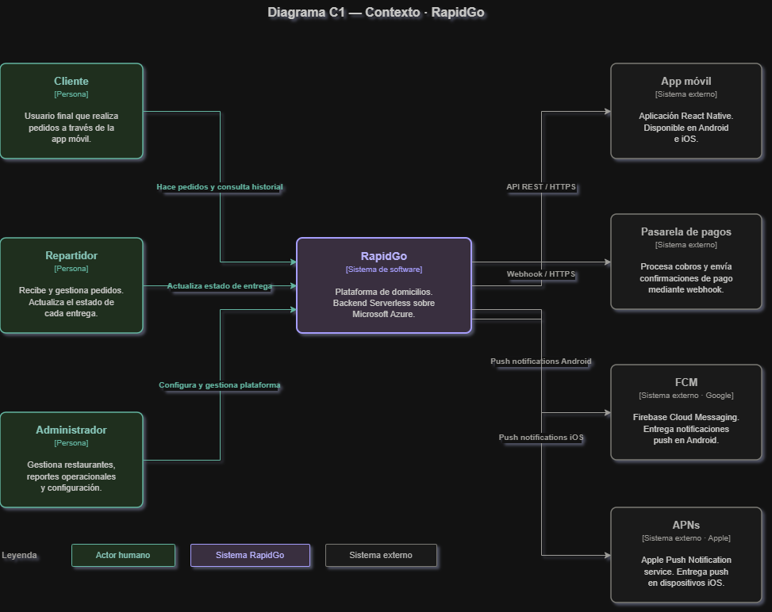

Actores humanos (izquierda — verde azulado)
Estos son las personas que usan el sistema directamente:

Cliente — es el usuario final de la app. Abre la app, elige un restaurante o tienda, hace el pedido y paga. Su único canal de interacción con RapidGo es a través de la app móvil.

Repartidor — tiene su propia vista dentro de la misma app. Recibe el pedido asignado y conforme lo lleva, actualiza el estado: "recogido", "en camino", "entregado". Esas actualizaciones son las que disparan las notificaciones al cliente.

Administrador — es el equipo interno de RapidGo. Configura el sistema: agrega restaurantes, gestiona reportes de ventas, ajusta comisiones, No usa la app móvil sino un panel administrativo.

Sistema central (centro — morado)
En este momento solo se tiene una idea de lo que se necesita para el C1, ya uqe en el momento solo tiene un nombre y solo importa que existe y tiene nombre.


Sistemas externos (derecha — gris)

Estos son sistemas que RapidGo usa pero no controla ni posee:

App móvil (React Native) — es un sistema externo y es el cliente frontend que se comunica con RapidGo via HTTPS. 

Pasarela de pagos — cuando el cliente confirma el pago en la app, la pasarela procesa el cobro y le avisa a RapidGo mediante un webhook (una llamada HTTP automática que dice "el pago fue exitoso"). RapidGo entonces confirma el pedido.

FCM (Firebase Cloud Messaging) — es el servicio de Google que entrega las notificaciones push en Android. RapidGo no le habla directamente a los celulares — le habla a FCM y FCM que se encarga del resto.

APNs (Apple Push Notification service) — lo mismo pero para iOS. Toda notificación que llega a un iPhone pasa por los servidores de Apple. Sin integración directa con APNs.


### C2 — Diagrama de Contenedores
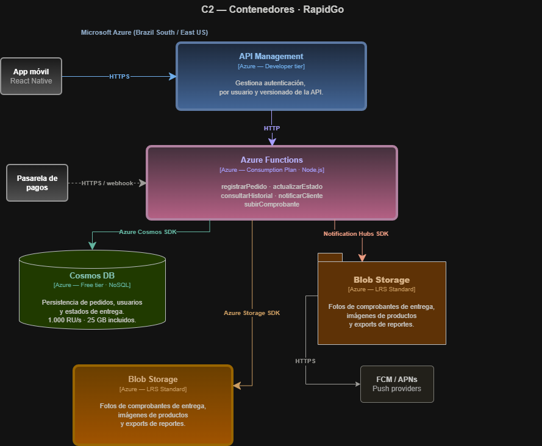

### C3 — Diagrama de Componentes
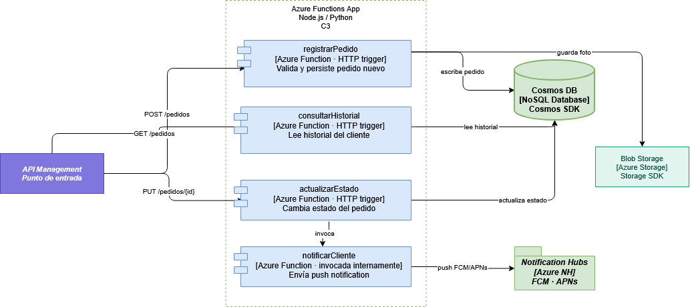

---

## 3. Decisiones arquitectónicas (ADRs)

## ADR-01: Azure Functions vs App Service para la lógica de negocio

Fecha:Mayo 2026  
Estado:Aprobado

Contexto
RapidGo presenta un patrón de tráfico altamente variable: 1.200 pedidos diarios en promedio con picos de hasta 4.500 en días festivos y fines de semana. El backend monolítico actual en Node.js, desplegado en un servidor dedicado, se satura en horas pico (12m–2pm y 6pm–9pm), superando los 8 segundos de tiempo de respuesta. El costo fijo de $4.200.000 COP mensuales es ineficiente dado que el uso de CPU no supera el 4% en horas de baja demanda. El equipo de desarrollo tiene experiencia en Node.js y Python, y el presupuesto piloto no debe superar los $50 USD mensuales en Azure.

Alternativas evaluadas

Opción A — Azure App Service (Plan Básico)

Ventajas
* Entorno de ejecución permanente, sin cold starts [1]
* Soporte nativo para Node.js y Python

Desventajas
* Costo fijo mensual (~$13–$55 USD en tier básico), incompatible con el modelo de pago por uso requerido
* El escalado automático requiere configuración manual de reglas; no escala desde cero ante picos abruptos [1]
* No elimina el problema de costo en horas de baja demanda


Opción B — Azure Functions (Consumption Plan)

Ventajas
* Escalado automático de 0 a N instancias sin intervención manual, basado en eventos [2]
* Modelo de pago por ejecución: 1 millón de ejecuciones/mes incluidas gratis [3]
* Zero-downtime en despliegues mediante deployment slots [4]
* Compatible con Node.js y Python
* Sin administración de servidores ni clusters

Desventajas
* Cold starts: latencia adicional en la primera ejecución tras inactividad, dado que el Consumption Plan escala desde cero [2]
* Tiempo máximo de ejecución de 10 minutos por función en Consumption Plan [1]
 
Decisión

Se elige Azure Functions con Consumption Plan.

El modelo de costos por ejecución resuelve directamente el desperdicio del 96% de capacidad en horas de baja demanda. El escalado automático basado en eventos garantiza el requerimiento de soportar 500 req/seg sin intervención manual durante días festivos [2]. El tier gratuito de 1M ejecuciones/mes se alinea con el presupuesto piloto de $50 USD [3].

Consecuencias
Ventajas:Eliminación del costo fijo, escalado automático en picos, despliegues sin downtime, sin gestión de infraestructura.
Trade-offs:Los cold starts pueden introducir latencia en las primeras solicitudes tras inactividad. Según la documentación oficial, el Consumption Plan no soporta la opción "Always On"; para eliminar cold starts completamente sería necesario migrar al Premium Plan [1][2].

### Referencias

- [1] Microsoft Learn — *Azure Functions Premium plan*: https://learn.microsoft.com/es-es/azure/azure-functions/functions-premium-plan
- [2] Microsoft Learn — *Event-driven scaling in Azure Functions*: https://learn.microsoft.com/es-es/azure/azure-functions/event-driven-scaling
- [3] Microsoft Learn — *Azure Functions overview*: https://learn.microsoft.com/es-es/azure/azure-functions/functions-overview
- [4] Microsoft Learn — *Azure Functions best practices*: https://learn.microsoft.com/es-es/azure/azure-functions/functions-best-practices


## ADR-02: Cosmos DB vs Azure SQL Database para la persistencia de pedidos

Fecha:Mayo 2026  
Estado:Aprobado

Contexto
La base de datos actual de RapidGo es MySQL relacional con 3 años de datos históricos. El nuevo sistema debe soportar atributos variables por tipo de negocio (restaurantes vs. tiendas), alta disponibilidad (99.9%), baja latencia de escritura y lectura, y escalado automático. Los datos de usuarios colombianos deben residir en las regiones Brazil South o East US. El presupuesto piloto limita el gasto a $50 USD mensuales.

Alternativas evaluadas
Opción A — Azure SQL Database (Free Tier)

Ventajas
* Modelo relacional familiar, compatible con la estructura MySQL actual
* Free tier de 32 GB disponible, sin costo en fase piloto
* Consultas SQL estándar, sin curva de aprendizaje adicional

Desventajas
* Esquema rígido: cada tipo de negocio requeriría tablas o columnas adicionales para atributos específicos
* Escalado vertical manual en el tier gratuito
* Menor rendimiento en escrituras concurrentes masivas

Opción B — Azure Cosmos DB (Free Tier)

Ventajas
* Modelo de documento flexible (schema-agnostic): cada pedido puede tener atributos distintos según el tipo de negocio sin alterar el esquema [5]
* Latencia de lectura y escritura garantizada en single-digit milliseconds en el percentil 99 [6]
* Free tier permanente: 1.000 RU/s y 25 GB sin costo [7]
* Distribución global con réplicas en Brazil South y East US, cumpliendo la restricción de soberanía de datos [7]
* Escalado horizontal automático mediante particionamiento

Desventajas
* Cambio de paradigma relacional a NoSQL: requiere migración y rediseño del modelo de datos
* Las consultas complejas con múltiples JOINs son menos eficientes que en SQL [5]

Decisión

Se elige Azure Cosmos DB con Free Tier.

El modelo de documento es más adecuado para la naturaleza variable de los pedidos de RapidGo. Según la documentación oficial, Cosmos DB garantiza latencias de lectura y escritura menores a 10ms en el percentil 99 [6], cumpliendo el requerimiento de latencia de API < 800ms en P95. La distribución global nativa garantiza el cumplimiento de la restricción de soberanía de datos. El free tier cubre completamente las necesidades de la fase piloto [7].

Consecuencias
Ventajas:Esquema flexible, latencia baja garantizada por SLA, escalado sin intervención manual, cumplimiento de soberanía de datos.
Trade-offs:Se asume la deuda técnica de migrar 3 años de datos históricos desde MySQL. Las consultas analíticas complejas requerirán estrategias adicionales como exportaciones periódicas.

### Referencias

- [5] Microsoft Learn — *Azure Cosmos DB introduction*: https://learn.microsoft.com/es-es/azure/cosmos-db/introduction
- [6] Microsoft Learn — *Consistency levels in Azure Cosmos DB*: https://learn.microsoft.com/es-es/azure/cosmos-db/consistency-levels
- [7] Microsoft Learn — *Azure Cosmos DB free tier*: https://learn.microsoft.com/es-es/azure/cosmos-db/free-tier


## ADR-03: API Management vs exposición directa de Azure Functions

Fecha:Mayo 2026  
Estado:Aprobado

Contexto:
La app móvil de RapidGo en React Native realiza llamadas directas a la API del backend. La arquitectura actual carece de un gateway centralizado, lo que ha generado deuda técnica en autenticación JWT implementada de forma artesanal. El nuevo sistema debe gestionar autenticación, throttling por usuario, versionado de API y mantener compatibilidad con los contratos de endpoints actuales. El equipo de infraestructura es de una sola persona.

Alternativas evaluadas

Opción A — Exposición directa de Azure Functions (HTTP Trigger)

Ventajas
* Configuración mínima, sin servicios adicionales
* Menor latencia al eliminar un salto de red intermedio
* Sin costo adicional

Desventajas
* Cada función debe implementar su propia lógica de autenticación JWT, duplicando código
* Sin throttling centralizado
* Sin versionado de API: cualquier cambio de contrato rompe la app móvil
* Dificulta agregar futuros clientes sin refactorizar cada función

Opción B — Azure API Management (Developer Tier)

Ventajas
* Punto de entrada único para todos los clientes [8]
* Gestión centralizada de autenticación JWT mediante políticas de validación de tokens [8]
* Throttling configurable por usuario o suscripción [8]
* Versionado de API sin afectar los contratos actuales de la app móvil [8]
* Portal de desarrolladores y documentación automática de endpoints

Desventajas
* Developer tier tiene costo (~$50 USD/mes), ajustado al límite del presupuesto piloto
* Latencia adicional de ~20–50ms por el salto extra del gateway [8]


Decisión

Se elige Azure API Management en Developer Tier.

Centralizar la autenticación JWT en API Management elimina la deuda técnica documentada. Según la documentación oficial, API Management actúa como fachada para las APIs de backend, permitiendo gestionar autenticación, throttling y versionado desde un único punto [8]. El versionado garantiza compatibilidad con la app móvil existente mientras se introducen mejoras en la API.

Consecuencias
Ventajas:Autenticación centralizada, protección ante sobrecarga, versionado de API, base para agregar nuevos clientes.
Trade-offs:El Developer tier consume la mayor parte del presupuesto piloto. En producción se evaluará el tier Consumption de API Management por su modelo de pago por llamada.

## Referencias
- [8] Microsoft Learn — *Azure API Management key concepts*: https://learn.microsoft.com/es-es/azure/api-management/api-management-key-concepts


## ADR-04: Blob Storage vs Azure Files para almacenamiento de archivos

Fecha:Mayo 2026  
Estado:Aprobado

Contexto:
RapidGo necesita almacenar fotos de comprobantes de entrega, imágenes de productos y exports de reportes operacionales. Los archivos son generados desde la app móvil (imágenes JPEG) y desde las Azure Functions (reportes CSV). El acceso es predominantemente de escritura única y lectura ocasional vía HTTP. El presupuesto piloto exige minimizar costos de almacenamiento.

Alternativas evaluadas

Opción A — Azure Files
Ventajas
* Acceso mediante protocolo SMB/NFS, ideal para sistemas de archivos compartidos montados por múltiples servicios [9]
* Útil cuando múltiples servicios necesitan acceso concurrente de lectura/escritura como un disco compartido

Desventajas
* Costo mayor: ~$0.06 USD/GB/mes en tier estándar, significativamente más alto que Blob Storage [9]
* No optimizado para acceso HTTP directo a objetos estáticos como imágenes
* Protocolo SMB innecesario para el caso de uso de RapidGo


Opción B — Azure Blob Storage (LRS Standard)
Venatajas
* Diseñado para almacenamiento de objetos no estructurados: imágenes, videos, documentos [10]
* Acceso HTTP/HTTPS directo mediante URLs firmadas (SAS tokens), sin intermediarios [10]
* Tier LRS es el más económico: ~$0.018 USD/GB/mes [10]
* Integración nativa con Azure Functions mediante output bindings
* Soporte para políticas de ciclo de vida: mover archivos a tier frío (Cool/Archive) automáticamente [10]

Desventajas
* Sin soporte para protocolo SMB (no requerido por RapidGo)


Decisión

Se elige Azure Blob Storage con tier LRS Standard.

El patrón de acceso de RapidGo (escritura desde app móvil, lectura ocasional vía URL HTTP) corresponde exactamente al caso de uso de Blob Storage [10]. Los SAS tokens permiten que la app móvil suba fotos directamente a Blob Storage sin consumir recursos de las Azure Functions. El costo LRS Standard es aproximadamente 3 veces menor que Azure Files.

Consecuencias
Ventajas: Costo mínimo de almacenamiento, acceso HTTP directo, integración nativa con Functions, ciclo de vida automático de archivos.
Trade-offs: La redundancia LRS protege contra fallos de hardware en un datacenter pero no ante fallos de zona completa. En producción se evaluará ZRS para mayor resiliencia.

### Referencias

- [9] Microsoft Learn — *Introduction to Azure Files*: https://learn.microsoft.com/es-es/azure/storage/files/storage-files-introduction
- [10] Microsoft Learn — *Introduction to Azure Blob Storage*: https://learn.microsoft.com/es-es/azure/storage/blobs/storage-blobs-introduction


## ADR-05: Notification Hubs vs Azure Communication Services para notificaciones push

Fecha: Mayo 2026  
Estado: Aprobado

Contexto

El sistema actual de push notifications de RapidGo tiene una tasa de entrega del 67% debido a la falta de integración directa con FCM (Firebase Cloud Messaging) y APNs (Apple Push Notification service). El requerimiento es alcanzar una tasa de entrega superior al 95%. Las notificaciones deben enviarse en tiempo real cuando cambia el estado de un pedido (confirmado → en camino → entregado). La app móvil está en React Native y no se rediseñará.

Alternativas evaluadas

Opción A — Azure Communication Services (ACS)
Ventajas
* Servicio unificado para múltiples canales: SMS, email, voz, chat y push notifications [11]
* SDK moderno con soporte para React Native
* Útil si RapidGo planea expandir canales de comunicación en el futuro

Desventajas
* La funcionalidad de push notifications en ACS tiene menor madurez comparada con Notification Hubs para envíos masivos [11]
* Costo por notificación más elevado para volúmenes altos
* Configuración más compleja para integración directa con FCM y APNs

Opción B — Azure Notification Hubs
Ventajas
* Diseñado específicamente para envío masivo de push notifications a Android (FCM) y iOS (APNs) [12]
* Free tier incluye 1 millón de notificaciones/mes [12]
* Integración directa y documentada con FCM y APNs, resolviendo la causa raíz de la baja tasa de entrega [12]
* Soporte para notificaciones segmentadas por etiquetas (tags), permitiendo notificar solo al cliente de un pedido específico [12]
* Servicio maduro disponible en Azure desde 2014

Desventajas
* Servicio especializado únicamente en push notifications; no cubre SMS ni email [12]
* Requiere configurar un proyecto Firebase (FCM) gratuito como proveedor Android


Decisión

Se elige Azure Notification Hubs con Free Tier.

La causa documentada de la baja tasa de entrega (67%) es la ausencia de integración directa con FCM y APNs. Según la documentación oficial, Notification Hubs provee integración nativa con ambas plataformas y soporte para notificaciones segmentadas [12], lo que resuelve directamente el problema. El free tier de 1M notificaciones/mes supera ampliamente el volumen estimado de RapidGo: 4.500 pedidos/día × 3 estados × 30 días = ~405.000 notificaciones/mes.

Consecuencias
Ventajas: Integración nativa con FCM y APNs, tasa de entrega esperada >95%, free tier suficiente para fase piloto, notificaciones segmentadas por cliente.
Trade-offs: Notification Hubs cubre únicamente el canal push. Si RapidGo requiere SMS o email transaccional en el futuro, deberá incorporar ACS como servicio complementario.

### Referencias

- [11] Microsoft Learn — *Azure Communication Services overview*: https://learn.microsoft.com/es-es/azure/communication-services/overview
- [12] Microsoft Learn — *Azure Notification Hubs overview*: https://learn.microsoft.com/es-es/azure/notification-hubs/notification-hubs-push-notification-overview


## 4. Implementación del flujo crítico

### 4.1 Descripción del flujo

El flujo crítico de RapidGo cubre el ciclo de vida completo de un pedido: desde su registro hasta la notificación push al cliente. Las 4 Azure Functions desplegadas en el plan Consumption implementan cada paso de forma independiente y desacoplada.

| Paso | Método | Function | Acción |
|------|--------|----------|--------|
| 1 | POST | `registrarPedido` | Crea el pedido en Cosmos DB con estado `confirmado` |
| 2 | PUT | `actualizarEstado` | Cambia el estado del pedido (ej. `en_camino`) |
| 3 | GET | `consultarHistorial` | Retorna todos los pedidos de un cliente ordenados por fecha |
| 4 | POST | `notificarCliente` | Envía push notification vía Azure Notification Hubs |

### 4.2 URLs de las functions desplegadas

| Function | Método | URL |
|----------|--------|-----|
| registrarPedido | POST | `https://func-rapidgo-piloto-f4haf8ftbehkgzf0.eastus2-01.azurewebsites.net/api/registrarpedido` |
| actualizarEstado | PUT | `https://func-rapidgo-piloto-f4haf8ftbehkgzf0.eastus2-01.azurewebsites.net/api/actualizarestado/{id}` |
| consultarHistorial | GET | `https://func-rapidgo-piloto-f4haf8ftbehkgzf0.eastus2-01.azurewebsites.net/api/consultarhistorial?clienteId={id}` |
| notificarCliente | POST | `https://func-rapidgo-piloto-f4haf8ftbehkgzf0.eastus2-01.azurewebsites.net/api/notificarcliente` |

### 4.3 Prueba del flujo con curl

**Paso 1 — Registrar pedido**

```bash
curl -X POST https://func-rapidgo-piloto-f4haf8ftbehkgzf0.eastus2-01.azurewebsites.net/api/registrarpedido \
  -H "Content-Type: application/json" \
  -d '{
    "clienteId": "cliente-001",
    "restauranteId": "rest-001",
    "productos": [{"nombre": "Hamburguesa", "precio": 25000, "cantidad": 1}],
    "direccionEntrega": "Calle 50 #10-20, Medellin"
  }'
```

Respuesta esperada: `HTTP 201` con el pedido creado y `"estado": "confirmado"`. Guardar el campo `id` para los siguientes pasos.

**Paso 2 — Actualizar estado**

```bash
curl -X PUT https://func-rapidgo-piloto-f4haf8ftbehkgzf0.eastus2-01.azurewebsites.net/api/actualizarestado/{pedidoId} \
  -H "Content-Type: application/json" \
  -d '{"clienteId": "cliente-001", "estado": "en_camino"}'
```

Estados válidos: `confirmado` | `en_preparacion` | `en_camino` | `entregado` | `cancelado`

**Paso 3 — Consultar historial**

```bash
curl -X GET "https://func-rapidgo-piloto-f4haf8ftbehkgzf0.eastus2-01.azurewebsites.net/api/consultarhistorial?clienteId=cliente-001"
```

Respuesta esperada: `HTTP 200` con `total` y array de `pedidos` ordenados por fecha descendente.

**Paso 4 — Notificar cliente**

```bash
curl -X POST https://func-rapidgo-piloto-f4haf8ftbehkgzf0.eastus2-01.azurewebsites.net/api/notificarcliente \
  -H "Content-Type: application/json" \
  -d '{
    "clienteId": "cliente-001",
    "pedidoId": "{pedidoId}",
    "estado": "en_camino",
    "mensaje": "Tu pedido ya va en camino!"
  }'
```

### 4.4 Evidencia de ejecución exitosa

El flujo fue ejecutado y verificado el 23 de mayo de 2026 contra los servicios reales en Azure:

- **Pedido creado:** `pedido-1779524788130` en Cosmos DB (`rapidgo-db` / `pedidos`)
- **Estado actualizado:** `confirmado` → `en_camino` con `fechaActualizacion` registrada
- **Historial consultado:** 1 pedido retornado para `cliente-001`
- **Notificación enviada:** `success: true` vía Azure Notification Hubs

---
## 5. Evidencias de implementación
### 5.1 Grupo de Recursos

El grupo de recursos `rg-rapidgo-piloto` consolida los 5 servicios del piloto
en la región East US 2, permitiendo gestión unificada y eliminación limpia del
entorno de pruebas.

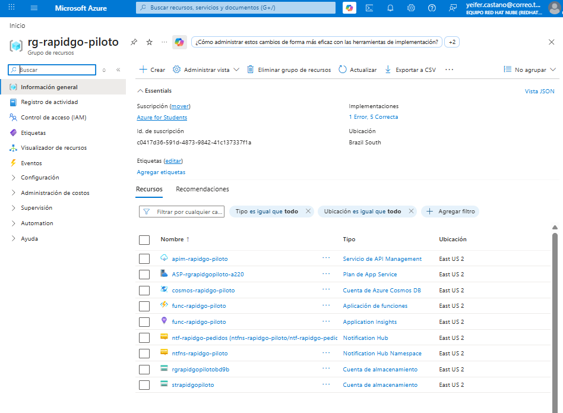

---

### 5.2 Azure Cosmos DB

#### Implementación completada
La cuenta `cosmos-rapidgo-piloto` se desplegó exitosamente en `rg-rapidgo-piloto`
bajo la suscripción *Azure for Students*.

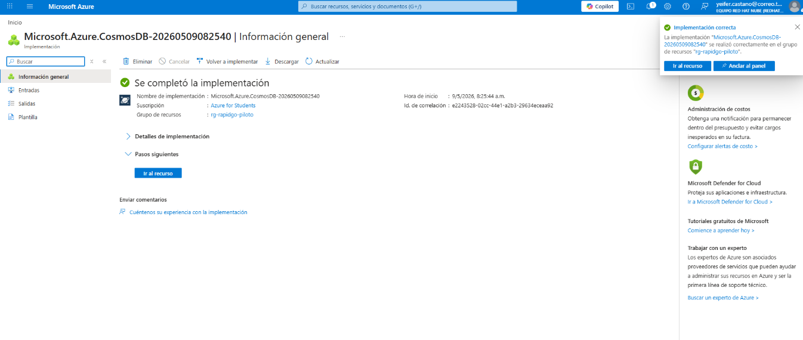

#### Panel principal
Estado **En línea**, modo de capacidad **Sin servidor** (Serverless), región
**East US 2**. El URI `https://cosmos-rapidgo-piloto.documents.azure.com:443/`
es el endpoint que usan las Azure Functions para conectarse a la base de datos.

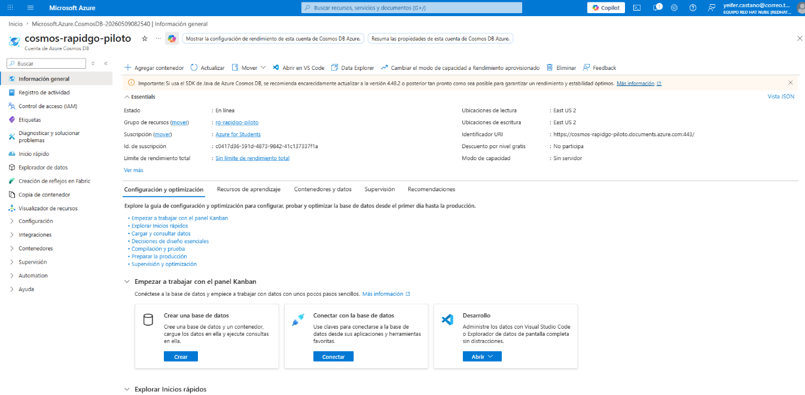

#### Base de datos y contenedor
Se creó la base de datos `rapidgo-db` con el contenedor `pedidos` usando
`/clienteId` como clave de partición. Esta elección agrupa físicamente todos
los pedidos de un mismo cliente en una partición, optimizando la latencia de
las consultas de historial.

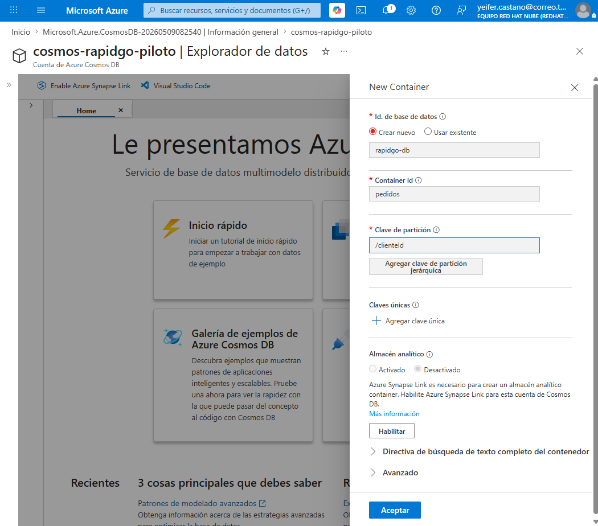

---

### 5.3 Azure Blob Storage

La cuenta `strapidgopiloto` se desplegó correctamente en `rg-rapidgo-piloto`.
Almacena logs de ejecución de las Functions y comprobantes de entrega.

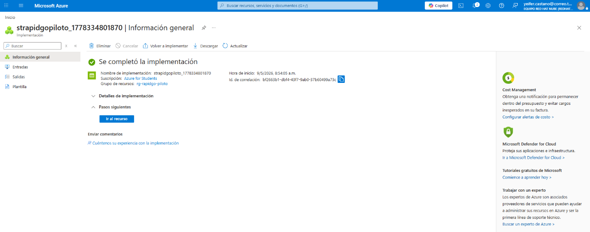

---

### 5.4 Azure Functions

#### 4 funciones desplegadas y habilitadas
Las 4 functions están en estado **Habilitada** con trigger HTTP, confirmando
el despliegue exitoso en el plan Consumption.

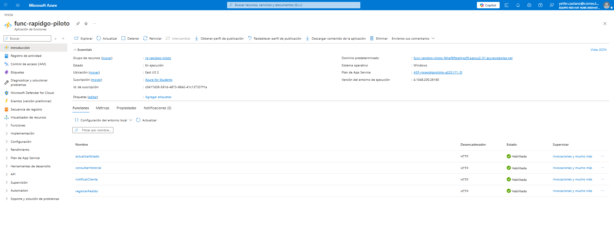

#### Variables de entorno configuradas
Las variables `COSMOS_CONNECTION_STRING`, `NOTIFICATION_HUB_CONNECTION_STRING`
y `NOTIFICATION_HUB_NAME` fueron configuradas directamente en Azure via CLI,
sin exponer credenciales en el código fuente.

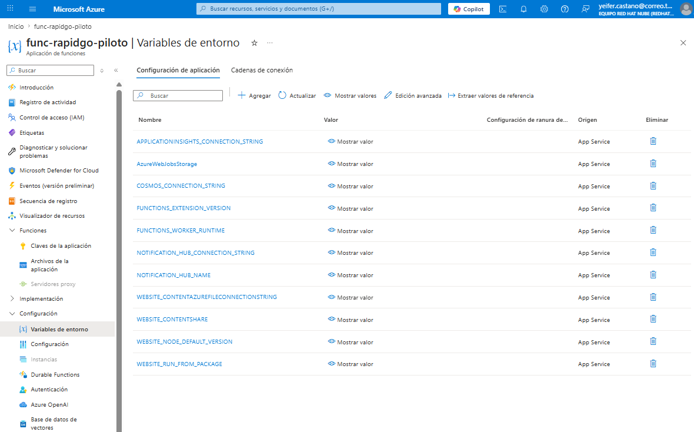

#### Invocaciones de registrarPedido
El monitor de invocaciones confirma **2 ejecuciones exitosas** y **0 errores**
en los últimos 30 días. El código 201 corresponde a un pedido creado
correctamente; el código 400 confirma que la validación de campos funciona.

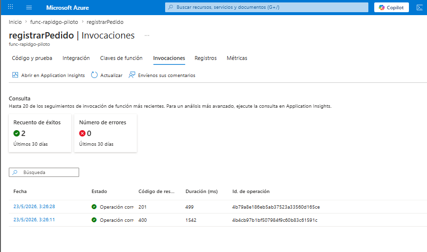

---

### 5.5 Documento persistido en Cosmos DB

El pedido `pedido-1779524788130` fue creado por `registrarPedido` y actualizado
por `actualizarEstado`. El documento muestra el estado final `en_camino` con
`fechaActualizacion` registrada, confirmando que ambas functions operaron
correctamente sobre Cosmos DB.

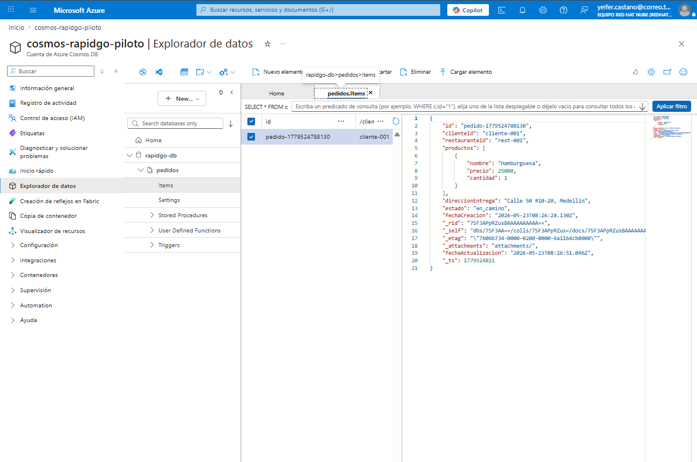

---

### 5.6 Flujo completo probado con Postman

#### Paso 1 — registrarPedido (201 Created, 686ms)
Pedido creado con productos, dirección y estado inicial `confirmado`.

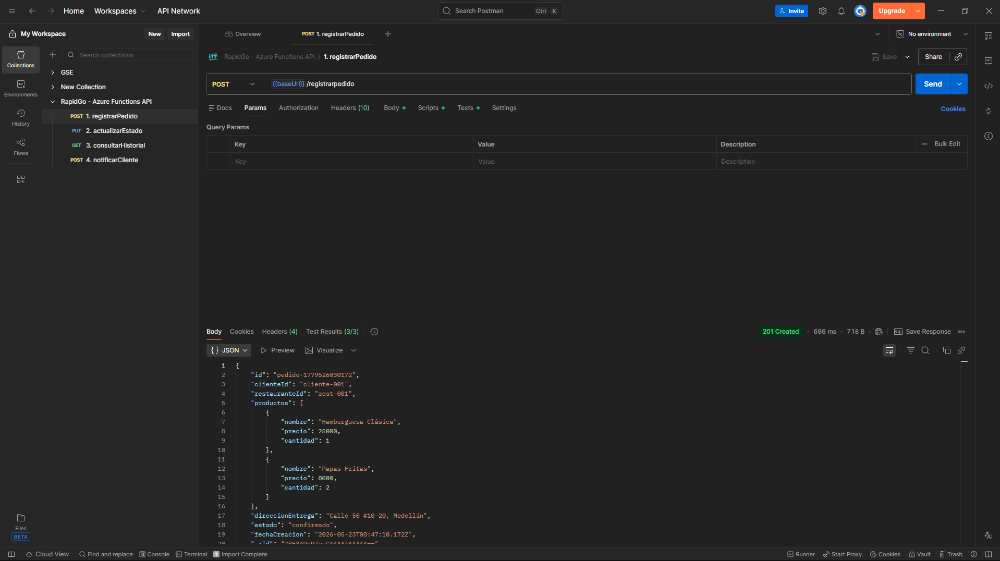

#### Paso 2 — actualizarEstado (200 OK, 621ms)
Estado actualizado a `en_camino`. El `pedidoId` fue pasado automáticamente
desde la variable de colección guardada en el paso anterior.

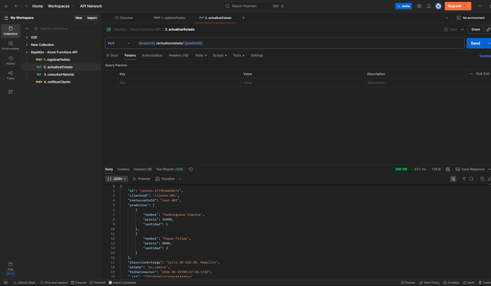

#### Paso 3 — consultarHistorial (200 OK, 217ms)
Retorna `total: 2` pedidos del cliente. Se confirma que el estado `en_camino`
quedó persistido correctamente en Cosmos DB.

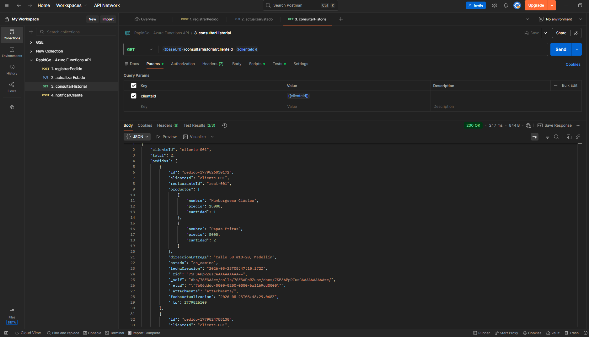

#### Paso 4 — notificarCliente (200 OK, 108ms)
Notificación enviada exitosamente. `success: true` y
`canal: "Azure Notification Hubs → FCM/APNs"` confirman la integración
completa con el servicio de notificaciones.

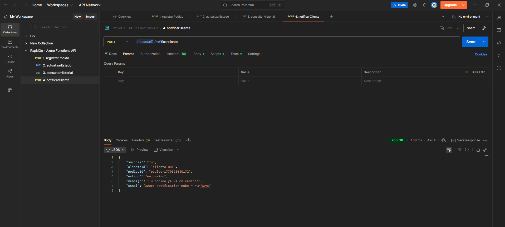

---

## 6. Conclusiones

### 6.1 Validación de requerimientos no funcionales

| Requerimiento | Solución implementada | Resultado esperado |
|---|---|---|
| Disponibilidad 99.9% | Azure Functions Consumption con SLA de Microsoft | Máximo 44 min inactividad/mes |
| Latencia < 800 ms P95 | Cosmos DB Serverless en East US 2 | Elimina saturación del monolito |
| Escalabilidad 500 req/seg | Escalado automático del plan Consumption | Soporta días festivos sin intervención |
| Pago por uso | Plan Consumption: $0 en horas de baja demanda | Elimina costo fijo de $4.2M COP/mes |
| Zero-downtime | Despliegue por función independiente | Sin ventanas de mantenimiento |
| Notificaciones > 95% | Notification Hubs con FCM/APNs nativo | Resuelve tasa de entrega del 67% |

### 6.2 Lecciones aprendidas

**Modelo serverless:** El plan Consumption elimina la gestión de servidores pero
introduce el *cold start*: la primera invocación de una Function inactiva puede
tardar entre 1 y 3 segundos adicionales. Para RapidGo esto es mitigable con
*warm-up triggers* programados antes de las horas pico (11:30am y 5:30pm).

**Cosmos DB y partition key:** La elección de `/clienteId` como clave de
partición optimiza las consultas de historial agrupando los pedidos por cliente.
Esta decisión es irreversible una vez cargados los datos, por lo que debe
analizarse con cuidado antes del despliegue productivo.

**Integración event-driven:** El desacoplamiento entre Functions y Notification
Hubs mejora la resiliencia: si una notificación falla, no afecta el registro del
pedido. Esto requiere diseñar políticas de reintento para garantizar entrega eventual.

**API Management:** Es el componente de mayor complejidad de configuración pero
el de mayor valor estratégico, ya que permite agregar nuevos clientes (app web,
API pública para restaurantes) sin modificar el código de las Functions.

### 6.3 Proyección a producción

La arquitectura del piloto es la base de una plataforma que puede evolucionar
hacia analítica en tiempo real con Azure Stream Analytics, gestión de
repartidores con geolocalización y sistema de pagos integrado, sin necesidad
de rediseñar los componentes actuales.

---

